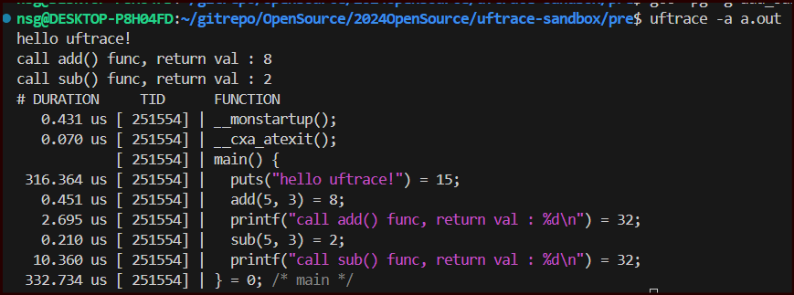

- 옵션들
    - `-g` 
        - gdb에게 제공하는 정보, 디버깅 심볼을 바이너리에 삽입
        - 소스 정보를 바이너리 안에 포함
        - gdb로 디버깅 시 소스를 보며 디버깅 가능
        - 이 옵션이 없으면, 어셈블리를 보고 디버깅해야함
    - `-pg`:  
        - profile을 위한 코드 삽입
        - 함수 호출을 추적하거나 걸린 시간 확인 가능
        - 
    - `-finstrument-functions` : 
        - 함수의 시작과 끝에 다른 함수를 삽입
        - 디버깅이 어려운 환경 (임베디드, 멀티 프로세스 등) 에 도움
        - 코드 수정없이 디버깅


> 윈도우와의 차이점: 윈도우는 디버깅 정보를 별개의 파일 PDB에 저장


### uftrace live 실행 결과

```
/uftrace-sandbox/pre$ uftrace live a.out
hello uftrace!
call add() func, return val : 8
call sub() func, return val : 2
# DURATION     TID      FUNCTION
   0.331 us [ 247950] | __monstartup();
   0.060 us [ 247950] | __cxa_atexit();
            [ 247950] | main() {
  22.814 us [ 247950] |   puts();
   0.050 us [ 247950] |   add();
   2.084 us [ 247950] |   printf();
   0.040 us [ 247950] |   sub();
   1.452 us [ 247950] |   printf();
  27.001 us [ 247950] | } /* main */
```

- uftrace live?
    - uftrace record
        - `uftrace record a.out`
        - trace data 를 기록
        - uftrace.data 에 저장됨
    - uftrace replay
        - `uftrace replay`
        - function tree, record 된 데이터를 출력
    - uftrace live 
        - `uftrace live a.out`
        - record 와 replay 실행
        - `live` 키워드는 생략가능


### uftrace record 명령 실행 결과

```
uftrace-sandbox/pre$ uftrace record a.out
hello uftrace!
call add() func, return val : 8
call sub() func, return val : 2
```

### uftrace live 명령어와 -a 옵션 추가 차이점




```
  -a, --auto-args            Show arguments and return value of known functions
```

- `-a` 옵션을 사용하면 
    - 이전과 다르게 인수들이 추가, 리턴값들이 추가된 것을 볼 수 있음

- `g` 옵션을 사용하면 디버깅 심볼 정보가 포함되기 때문에 이를 활용한 것으로 보임
    - If debug information for the program (`gcc -g`) is available, `--auto-args` works even on functions inside the compiled the user programs.

#### 디버깅 심볼? (윈도우 기준) 

```
https://learn.microsoft.com/ko-kr/windows/win32/debug/symbol-files?redirectedfrom=MSDN

The DbgHelp API is able to use PDBs to obtain the following information.

publics and exports
global symbols
local symbols
type data
source files
line numbers
```

