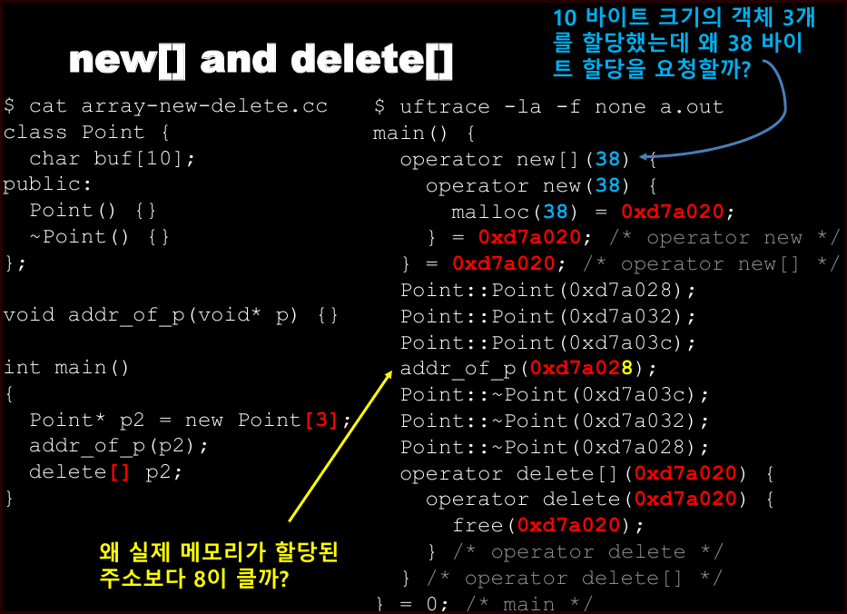
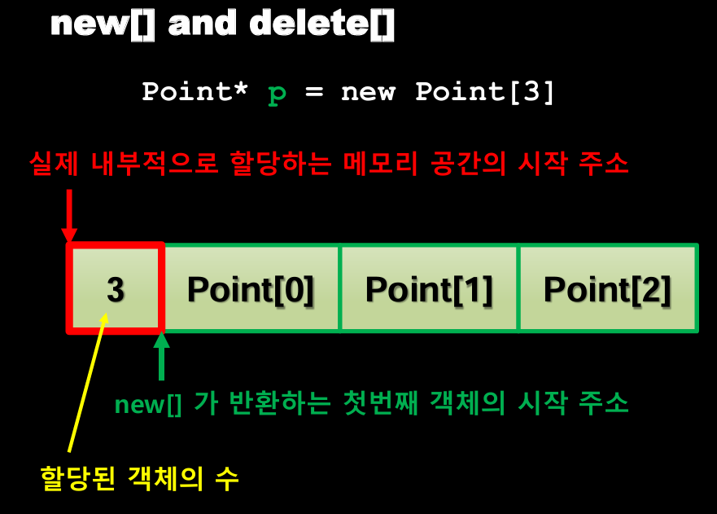
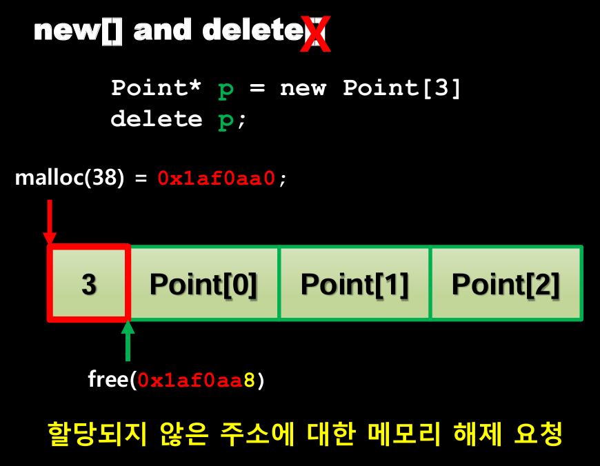
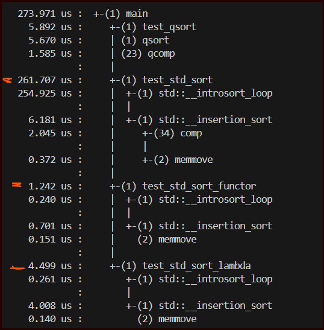
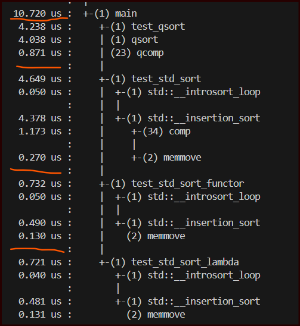
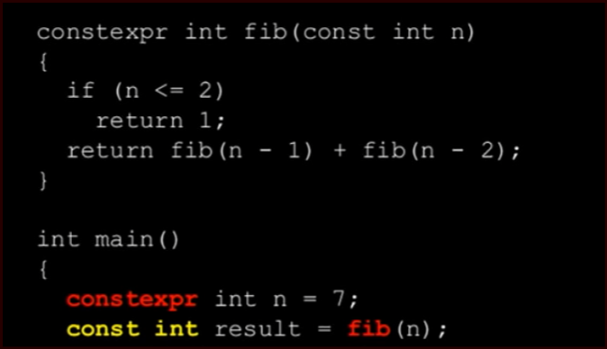

> 출처: https://uftrace.github.io/talks/uftrace_KSC_tutorial.pdf

- OS, 시스템 프로그래밍 교육을 위한 툴로 활용 가능
    - uftrace를 활용하면 언어의 동작방식을 이해할 수 있음
    - 어떻게 컴파일러가 최적화하는지, 어셈을 들여다 보지 않아도 내부 동작을 쉽게 알 수 있음

## std::endl 을 사용하지 말아야 하는 이유

- endl = `'\n' << std::flush`
- endl 이 포함된 반복문 > 불필요한 flush 호출이 많아짐

## array new delete

- 8바이트 추가 메모리 이유?
    - 배열에 할당된 객체의 수를 저장하는 데 사용
    - delete[] 연산자가 호출될 때 객체의 소멸자를 올바르게 호출
    - https://stackoverflow.com/questions/1728158/why-is-new-allocating-extra-memory

## zero cost abstractions

- std::unique_ptr 성능?
    - new, delete 직접 사용한 경우와 동일함 (최적화 적용)

## sort 함수 비교 (qsort와 std::sort 에 함수, functor, lambda)

- lambda 와 functor를 사용하는게 제일 빠름
    - lambda는 최적화 여지가 조금 더 있는 듯

## c++ 컨테이너 비교

- VECTOR
    - resize => 크기가 변할 때 copy 가 발생

- DEQUE 
    - 사이즈가 꽉차면 다른 청크를 찾음(추가적인 청크 할당)
    - copy 미발생

- LIST  
    - 원소 하나마다 할당 발생

## const 와 constexpr 차이

- 제대로 constexpr이 적용되었는지 uftrace를 통해 알 수 있음
    - ex) 피보나치